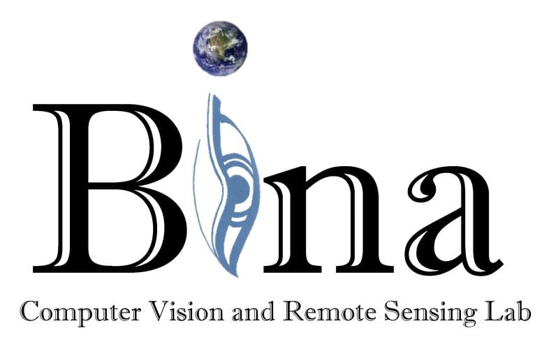
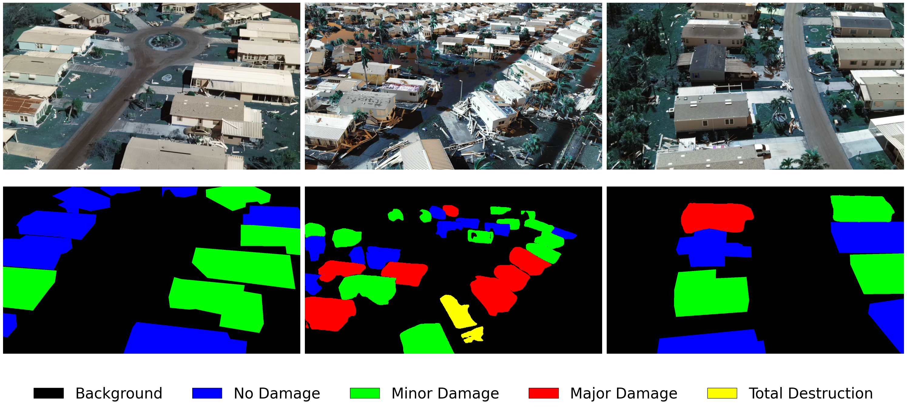
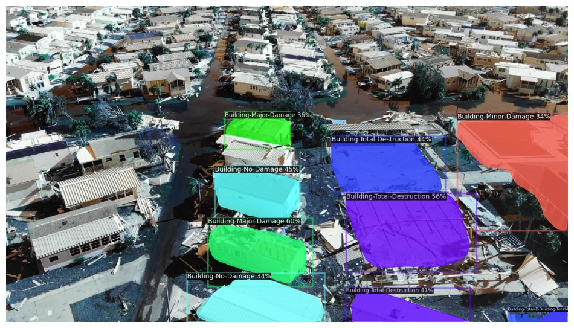

# 👋 Welcome to the Bina Lab Natural Disaster Team

> **“We don't just assess disasters — we build the tools to understand and prevent them.”**

---

## 🌪️ Who We Are

This GitHub repository is the official home of the **Natural Disaster Team** within [**Bina Lab at Lehigh University**](https://wordpress.lehigh.edu/binalab/).

We specialize in **remote sensing**, **semantic segmentation**, and **AI for disaster resilience** — using cutting-edge computer vision and machine learning techniques to detect, classify, and respond to damage from hurricanes, floods, wildfires, and other natural hazards.

This is where we open-source our research, datasets, benchmarks, and experiments. If you’re looking to contribute to **AI for social good**, you’re in the right place.

---

## 🔬 Our Research Focus

Our team builds tools and datasets for:

- 🛰️ **UAV- and satellite-based disaster damage assessment**
- 🎥 **Video-based semantic segmentation of affected regions**
- 🧠 **Efficient training pipelines for deep learning models in low-data environments**
- 🗂️ **Creation of large-scale, high-quality, annotated disaster datasets**

---

## 📦 Key Projects

### 🌀 HurricaneVidNet
**A high-resolution benchmark dataset for hurricane damage segmentation using UAV videos.**

- 40,000+ video frames
- 10,000+ manually annotated frames
- Fully COCO-formatted dataset
- 4 damage classes: No Damage, Minor, Major, Total Destruction
- Benchmarked with **Detectron2** and **Mask2Former**

---

### 🧪 DVIS++

**Decoupled Video Segmentation Model**  
Our internal baseline architecture used to evaluate HurricaneVidNet performance across temporal sequences.

- Utilizes frame decoupling and temporal consistency
- Trained with semi-supervised data
- Integrated with Detectron2 evaluation scripts

---

### 🧠 Semi-Automated Labeling Pipeline

To reduce the burden of manual annotation, we built a system that uses:

- **Mask2Former predictions**
- **Confidence-based filtering**
- **LabelBox/V7 Darwin integrations**  
To generate high-confidence prelabels and accelerate human-in-the-loop annotation.

---

## 📚 Resources

| Resource | Link |
|---------|------|
| 📄 HurricaneVidNet Paper (IGARSS 2025 Accepted) | *Coming Soon* |
| 🧠 Dataset Download (COCO format) | *Private until publication* |
| 📊 Evaluation Metrics & Scripts | [`projects/DVISplusplus/evaluation/`](./projects/DVISplusplus/evaluation/) |
| 🧑‍🏫 Detectron2 Primer + Quiz | [`docs/primer`](./docs/primer/) |
| 🌐 Full Bina Lab Website | [binalab.lehigh.edu](https://wordpress.lehigh.edu/binalab/) |

---

## 🖼️ Research Gallery

  
  

  

---

## 🙌 How to Get Involved

We welcome contributions from:

- 🧑‍💻 Engineers and researchers with experience in segmentation, detection, or video modeling
- 📊 Data scientists interested in disaster modeling or annotation automation
- 🧑‍🎓 Students looking for impactful ML projects

### 🚀 Getting Started

1. Clone the repo and check out `docs/` and `projects/`.
2. Open issues if you have questions or ideas.
3. Submit a PR following our `CONTRIBUTING.md` guide.

---

## 🌍 Why It Matters

- **Natural disasters displaced over 43 million people globally in 2022.**  
- Traditional damage assessment methods are **slow, expensive, and often unsafe.**  
- We aim to build **real-time, intelligent systems** to help first responders, governments, and researchers assess and respond to damage faster and more effectively.

---

## 🧑‍🔬 Meet the Team

This subteam is part of [Bina Lab](https://wordpress.lehigh.edu/binalab/) at Lehigh University, led by:

- 🧠 **Dr. Maryam Rahnemoonfar** – Lab Director  
- 💡 **TBA** – Research Leader (Natural Disaster Team)  

And an interdisciplinary team of undergraduate and graduate students in CS, engineering, and environmental science.

---

## 🌈 Contribution Guidelines

1. Be respectful and inclusive. We’re here to learn and help each other.
2. Please write clean, documented code with comments where needed.
3. If submitting data or models, include README + license files.

See `CONTRIBUTING.md` for full details.

---

## 🤖 Stack Overview

- ⚙️ **Frameworks:** PyTorch, Detectron2, MMDetection
- 📹 **Video Tools:** OpenCV, Albumentations
- 🖍️ **Annotation:** V7 Darwin, LabelBox
- 📡 **Hosting/Infra:** Google Drive, AWS, local HPC cluster
- 📄 **Format:** COCO JSON, PNG masks, and video MP4s

---

## 💬 Contact

- 📬 Email: **dotel.kevin@gmail.com**
- 🌐 Lab Website: [https://wordpress.lehigh.edu/binalab/](https://wordpress.lehigh.edu/binalab/)
- 🛠️ GitHub Issues: For bugs, ideas, and contributions

---

> *Built to help communities before, during, and after disaster strikes.*

